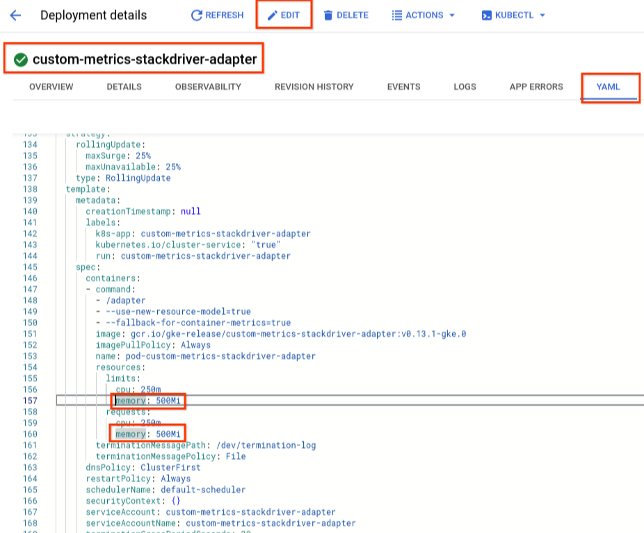

# HowTo: Setting up a Cloud Pathology Preview Deployment (IaC Playbook)

## Overview

This guide will walk you through the steps to set up a Cloud Pathology Preview
Deployment on your Google Cloud Platform (GCP) project. While we've provided an
infrastructure-as-code
([IaC](https://www.terraform.io/use-cases/infrastructure-as-code))
[blueprint](https://cloud.google.com/docs/terraform/blueprints/terraform-blueprints)
with default settings, you might need to adjust it to fit your organization's
specific needs, security guidelines, and policies. It's important to have a good
understanding of cloud services and know how to control external access for a
safe and successful deployment.

Tip: As you follow through this playbook, you may find it useful to **keep track
of all the environment variables you set**, in case you need to set them again
at a later time. You will need them e.g. if you need to re-run
`create_iac_config.sh` from step 2.

## Prerequisites

*   Required tools

    *   **Linux shell** to run commands such as
        [Cloud Shell](https://cloud.google.com/shell/docs/using-cloud-shell).
        Mac shell is not supported.
    *   **Terraform** command line installed (instructions
        [here](https://developer.hashicorp.com/terraform/tutorials/gcp-get-started/install-cli))
    *   **gcloud** command line installed (instructions
        [here](https://cloud.google.com/sdk/docs/install))
    *   **kubectl** command line installed (instruction
        [here](https://kubernetes.io/docs/tasks/tools/))

*   Set up options

    *   **GCP region**, referenced in this doc as `REGION`.

        See available regions
        [here](https://cloud.google.com/healthcare-api/docs/regions#available_regions).

    *   **Components to install**, referenced in this doc as `COMPONENTS`.

        Component names for deployment can be separated by commas. By default,
        'all' will deploy all components. Possible values include:

        *   `dicom_proxy`: deploys DICOMWeb Proxy
        *   `ilm`: deploys the Image Lifecycle Management (ILM) pipeline
        *   `transformation`: deploys the ingestion and transformation pipeline

    *   **Domain name** *(only if installing `dicom_proxy`
        )*,
        referenced in this doc as `DOMAIN_NAME`.

        The domain name for your service, which needs to be configured in
        ingress and used to manage certificates. **You need to have access to
        the DNS records of this domain to map it to the IP address that will be
        created below.** See [Step 5](#step5) for more details.

<a id="step0"></a>

## Step 0 - Prepare project

**GCP Project**, referenced in this doc as `PROJECT_ID`.

We recommend having an empty project. You need to have the following roles:

*   **Editor**
    ([roles/editor](https://cloud.google.com/iam/docs/understanding-roles#basic))
*   **Security Admin**
    ([roles/iam.securityAdmin](https://cloud.google.com/iam/docs/understanding-roles#iam.securityAdmin))
*   **Storage Admin**
    ([roles/storage.admin](https://cloud.google.com/iam/docs/understanding-roles#storage.admin))
*   **Bigquery Admin**
    ([roles/bigquery.admin](https://cloud.google.com/bigquery/docs/access-control#bigquery.admin))

You can verify your permissions
[here](https://console.cloud.google.com/iam-admin/iam). You will still need the
admin roles even if you are the owner of the project.

**Terraform state GCS bucket**, referenced in this doc as
`TF_STATE_BUCKET_NAME`.

The Terraform IaC (Infrastructure as Code) state is stored in a GCS (Google
Cloud Storage) bucket.

First authenticate with `gcloud` by running the following in the same terminal
window:

```sh
export PROJECT_ID=<set me>

gcloud init
gcloud auth login
gcloud auth application-default login  # for terraform
gcloud config set project ${PROJECT_ID?}
```

You can create a new bucket or reuse an existing one.

If you want to create a bucket with `gcloud`
(`$PROJECT_ID-cloud-pathology-tf-state` is a recommended bucket name format),
run:

```sh
export TF_STATE_BUCKET_NAME=$PROJECT_ID-cloud-pathology-tf-state
gcloud storage buckets create gs://$TF_STATE_BUCKET_NAME
```

**OR** you can use an existing GCS bucket with (please note
`TF_STATE_BUCKET_NAME` should not include `gs://` prefix):

```sh
export TF_STATE_BUCKET_NAME=<my existing bucket name>
```

## Step 1 - Fetch IaC code

1.  Create a directory for the IaC code by running the following commands in a
    terminal window:

    ```sh
    export CLOUD_MEDICAL_IMAGING_ROOT=$HOME/cloud_medical_imaging
    mkdir $CLOUD_MEDICAL_IMAGING_ROOT
    cd $CLOUD_MEDICAL_IMAGING_ROOT
    ```

2.  Run the following command to clone the repository:

    ```sh
    git clone https://github.com/GoogleCloudPlatform/medical-imaging.git $CLOUD_MEDICAL_IMAGING_ROOT

    export SOURCE_DIR=$CLOUD_MEDICAL_IMAGING_ROOT/iac/
    ```

## Step 2 - Create and customize IaC Configuration (pre-terraform)

<a id="step2.1"></a>

### Step 2.1 - (Only if installing `dicom_proxy`) Set up OAuth client

To configure oauth2 authentication, create a client ID in the project:

```sh
# DOMAIN_NAME that will be used for the applications, see above for details
export DOMAIN_NAME=<set me>

# SUPPORT_EMAIL can be your email address or a Google Group that you are an
# owner of, which will be displayed in the Oauth consent screen.
export SUPPORT_EMAIL=<set me>
gcloud config set project ${PROJECT_ID?}

# If you get a message to enable iap.googleapis.com select y. (API [iap.googleapis.com] not enabled on
# project [...]. Would you like to enable and retry (this will take a few minutes)? (y/N)?  y)
gcloud iap oauth-brands create \
--application_title="Cloud Pathology" \
--support_email=${SUPPORT_EMAIL?} \
--project=${PROJECT_ID?}
```

Then create an OAuth Client in Cloud Console:

1.  Navigate to the
    [API & Services > Credentials page](https://console.cloud.google.com/apis/credentials).
2.  Click **CREATE CREDENTIALS** and select **OAuth client ID**:

    

3.  Create a client id with the following info:

    

    *   Application type: **Web application**
    *   Name: **cloud-pathology-oauth-client**
    *   Authorized JavaScript origins: **https://`DOMAIN_NAME`** (e.g.
        https://www.my-cloud-pathology-app.com)
    *   Authorized redirect URIs: **https://`DOMAIN_NAME`/dpas/oauth_landing**
        (e.g. https://www.my-cloud-pathology-app.com/dpas/oauth_landing)
    *   Click **Create**

4.  After you create the client, navigate to the OAuth client page for it. Add
    **`https://iap.googleapis.com/v1/oauth/clientIds/<your client id>:handleRedirect`**
    to the Authorized redirect URIs. Now you should have two redirect URI
    entries as below:

    

5.  After the OAuth client is created, copy and store the client id and secret
    to be referenced later:

    ```sh
    # Store client id & secret to be used later (see image above for reference)
    export OAUTH_CLIENT_ID=<your client id>
    export OAUTH_CLIENT_SECRET=<your client secret>
    ```

<a id="step2.2"></a>

### Step 2.2 - Run IaC script to create terraform and k8s files for your project

Run the `create_iac_config.sh` shell script. The variables may be configured as
either environment variables (in uppercase) as specified in the prerequisite
section or as arguments to the script (using the corresponding lowercase). Check
the script for additional flags (e.g. `REGION`, `ZONE`,
`TRANSFORMATION_MACHINE_TYPE`, etc). If any of the
components listed below are not needed please omit them.

```sh
cd ${SOURCE_DIR?}

# The principals that will have read/write access to the main
# data storage (e.g. DICOM stores, BigQuery). This needs to be in
# Terraform list style and in format of Terraform IAM bindings.
# Example:
# export DATA_EDITORS=[\"group:my_group@example.com\",\"user:me@example.com\"]
export DATA_EDITORS=<set me>

# Update the following if needed, but these defaults should work
export COMPONENTS=all  # Check script if specifying which components to deploy
export REGION=us-west1
export ZONE=us-west1-a

# If using IAP, you can configure access to users by updating parameter below.
# Format should be the same as DATA_EDITORS parameter above. Using the same
# values as DATA_EDITORS is recommended.
export IAP_USERS=[]

# Update the following only if using a custom service account for the GKE
# cluster. This service account should have access to container images.
export GKE_SERVICE_ACCOUNT_EMAIL=""

# Reference to artifact registry where container images are located.
export ARTIFACT_REGISTRY=""

./create_iac_config.sh
```

This will create terraform files under `env/PROJECT_ID` folder


For more customization installation of each service please refer to documents:

*   HowTo: Digital Pathology WSI Transformation Pipeline to DICOM

<a id="step2.3"></a>

### Step 2.3 - (Only if installing `dicom_proxy` or `transformation`) Configure Redis for scalable, high performance caching

Redis is enabled by default. To configure different parameters for your use case
or disable, set the `dicom_proxy_redis_config` and `transformation_redis_config`
in `envs/PROJECT_ID/main.tf`. See `modules/env/variables.tf` for available
parameters. The default settings should work for general use cases.

## Step 3 - Manually apply terraform

**NOTE:** If you need to update variables or any of the GCP resources created
through terraform (e.g. a GCS bucket that was manually deleted, etc), you can
always re-run `terraform apply`. See details on the `apply` command
[here](https://developer.hashicorp.com/terraform/cli/commands/apply).

```sh
cd envs/${PROJECT_ID?}
terraform init
terraform plan # optional - to display the proposed changes
terraform apply
```

The terraform config will create some resources that need further configuration
or need to be referenced later in this document.

<a id="step3.1"></a>

### Step 3.1 - Configure access to the artifact registry

The GKE service account needs to be granted access to the containers.

*   If you set a custom `GKE_SERVICE_ACCOUNT_EMAIL` in [step 2.2](#step2.2),
    please use this value.
*   **OR**, if `GKE_SERVICE_ACCOUNT_EMAIL` was unset, verify the service account
    created through terraform with:

    ```sh
    gcloud iam service-accounts list | grep cloud-pathology-cluster-sa
    ```

    This will generate an output similar to:

    ```
    Service account of GKE cluster.
    cloud-pathology-cluster-sa@<PROJECT_ID>.iam.gserviceaccount.com  False
    ```

Make sure this service account has access to container images in
`ARTIFACT_REGISTRY`.

## Step 4 - Customize installation (post-terraform)

### Step 4.1 - (Only if installing `dicom_proxy` or `transformation`) Finish configuring Redis

The Redis host IP addresses (created in [Step 2.3](#step2.3) above) need to be
set in the `dicom_proxy` and `transformation` yaml. You can skip this
step if you manually disabled Redis in [Step 2.3](#step2.3).

*   For `dicom_proxy`:

    *   Find the Redis host endpoint with:

        ```sh
        gcloud redis instances describe dicom-proxy-redis-instance --region=${REGION?} | grep host
        ```

    *   Uncomment Redis flags in
        `SOURCE_DIR/k8s/overlays/PROJECT_ID/dicom_proxy_patch.yaml` and replace
        `REDIS_CACHE_HOST_IP` value with the host endpoint from above, resulting
        in a config like below (make sure env, name and value fields are all
        indented correctly):

        ```
        (...)
            containers:
            - name: dicom-proxy-container
                image: dicom-proxy-image
                env:
                - name: REDIS_CACHE_HOST_PORT
                value: '6379'
                - name: REDIS_CACHE_HOST_IP
                value: '<your Redis endpoint>'
        (...)
        ```

    *   (Optional) If using a custom Redis configuration with authentication,
        also set the `REDIS_AUTH_PASSWORD` flag. Auto generated auth id can be
        found in cloud console
        (https://console.cloud.google.com/memorystore/redis/locations/REGION/instances/dicom-proxy-redis-instance/details/overview?project=PROJECT_ID)

    *   (Optional) If using a custom Redis configuration with in-transit
        encryption, also set the `REDIS_TLS_CERTIFICATE_AUTHORITY_GCS_URI` flag
        to the Redis Certificate of Authority file. You will need to give access
        to the dicom_proxy service account
        (`dicom-proxy-k8s-sa@PROJECT_ID.iam.gserviceaccount.com`) to that file

    *   (Optional) Additionally, you can configure alert policies for CPU and
        memory utilization in cloud console
        (https://console.cloud.google.com/memorystore/redis/locations/REGION/instances/dicom-proxy-redis-instance/details/overview?project=PROJECT_ID)

*   For `transformation`:

    *   Find the Redis host endpoint with:

        ```sh
        gcloud redis instances describe transformation-redis-instance --region=${REGION?} | grep host
        ```

    *   Uncomment Redis flags in
        `SOURCE_DIR/k8s/overlays/PROJECT_ID/transformation_patch.yaml` and
        replace `REDIS_SERVER_IP` value with the host endpoint from above,
        resulting in a config like below (make sure env, name and value fields
        are all indented correctly):

        ```
        (...)
            containers:
            - name: transformation-container
              image: transformation-image
              env:
              (...)
              - name: REDIS_SERVER_PORT
                value: '6379'
              - name: REDIS_SERVER_IP
                value: '<your Redis endpoint>'
        (...)
        ```

### Step 4.2 - (Optional)(Only if using a self-managed certificate) Configure certificate in Ingress

The default configuration uses a Google-managed certificate. If instead you
would like to use self-managed certificate, **see documentation
[here](https://cloud.google.com/kubernetes-engine/docs/how-to/ingress-multi-ssl#specifying_certificates_for_your_ingress)**
for full details on how to create a certificate and specify it in the Ingress.

*   Update `SOURCE_DIR/k8s/base/ingress.yaml`, replacing the
    `cloud-pathology-managed-certificate` ManagedCertificate with your
    pre-shared certificate. Also add `DOMAIN_NAME` host to spec rules:

    ```yaml
    (...)
    # ---
    # apiVersion: networking.gke.io/v1
    # kind: ManagedCertificate
    # metadata:
    #   name: cloud-pathology-managed-certificate
    ---
    (...)
    apiVersion: networking.k8s.io/v1
    kind: Ingress
    metadata:
      name: cloud-pathology-ingress
      annotations:
        # cloud-pathology-global-static-ip-address is reserved via terraform
        kubernetes.io/ingress.global-static-ip-name: cloud-pathology-global-static-ip-address
        # networking.gke.io/managed-certificates: cloud-pathology-managed-certificate
        networking.gke.io/pre-shared-certificates: <your pre-shared certificate>
    spec:
      rules:
      - host: <your DOMAIN_NAME>
        http:
          paths:
    ```

*   Comment out `ingress_patch.yaml` in
    `SOURCE_DIR/k8s/overlays/PROJECT_ID/kustomization.yaml`:

    ```yaml
    (...)
    patchesStrategicMerge:
    # - ingress_patch.yaml
    (...)
    ```

<a id="step5"></a>

## Step 5 - (Only if installing `dicom_proxy`) Provision IP access

**Update DNS records** - Terraform will create a static IP address named
`cloud-pathology-global-static-ip-address` that should be visible in your
project’s
[IP address Cloud console](https://console.cloud.google.com/networking/addresses/list).
Update your DNS records for the `DOMAIN_NAME` used above to point to this IP
address, A or AAA record and a certificate if needed. See more details in
[Managed Certificate to be provisioned by GCP](https://cloud.google.com/load-balancing/docs/ssl-certificates/google-managed-certs#update-dns).

Please note record updates may [take up to 72h to propagate](https://cloud.google.com/load-balancing/docs/ssl-certificates/google-managed-certs#dns_record_propagation_time).

<a id="step6"></a>

## Step 6 - Manually apply kustomize

Get credentials for the cluster and make sure it succeeds:

*   If using a zone cluster:

    ```sh
    gcloud container clusters get-credentials cloud-pathology-cluster \
    --location ${ZONE?} \
    --project ${PROJECT_ID?}
    ```

*   **OR**, if using a regional cluster (i.e. `ZONE` env variable from
    [Step 2.2](#step2.2) was set to "none"):

    ```sh
    gcloud container clusters get-credentials cloud-pathology-cluster \
    --location ${REGION?} \
    --project ${PROJECT_ID?}
    ```

Apply k8s configs with kubectl:

**NOTE:** If you need to update any of the GKE workloads created through
kustomize (e.g. to configure Redis, updated IAP, etc), you can always re-run
`kubectl apply` as instructed below. See details on the `apply` command
[here](https://kubernetes.io/docs/reference/generated/kubectl/kubectl-commands#apply).

```sh
cd ../../k8s
# shows output that will be applied
kubectl kustomize overlays/${PROJECT_ID?}
# applies the configs
kubectl apply -k overlays/${PROJECT_ID?}
```

Note: if you receive a WARNING: cluster cloud-pathology-cluster is not RUNNING
message please note that the cluster might take a little while to transition
into RUNNING status or could be in process of being updated by GCP. You can see
the current status in https://console.cloud.google.com/kubernetes/list/overview

You can check workloads are successfully deployed in
https://console.cloud.google.com/kubernetes/workload/overview?project=PROJECT_ID.
**Please wait for deployment to finish before proceeding to next steps**.

## Step 7 - Enable Identity-Aware Proxy

### Step 7.1 - Setup IAP

After the workloads are configured, you can use
[Identity-Aware Proxy (IAP)](https://cloud.google.com/iap) to control access.
IAP includes fine-grained access control and is **strongly recommended** to
protect your service and data.

Get the service id for each service as applicable:

```sh
gcloud config set project ${PROJECT_ID?}
export DICOM_PROXY_SERVICE_ID=$(gcloud compute backend-services list --filter=dicom-proxy --uri | awk -F\/ '{ print $NF }')
```

Enable IAP for each service (using `OAUTH_CLIENT_ID` and `OAUTH_CLIENT_SECRET`
from [Step 2.1](#step2.1))

```sh
gcloud iap web enable --resource-type=backend-services \
--oauth2-client-id=${OAUTH_CLIENT_ID?} \
--oauth2-client-secret=${OAUTH_CLIENT_SECRET?} \
--service=${DICOM_PROXY_SERVICE_ID?}
```

After IAP is enabled, create a kubernetes secret:

```sh
kubectl create secret generic cloud-pathology-secret \
--from-literal=client_id=${OAUTH_CLIENT_ID?} \
--from-literal=client_secret=${OAUTH_CLIENT_SECRET?}
```

Then update the
`dicom_proxy` kustomize yaml (which can be
found at `SOURCE_DIR/k8s/overlays/PROJECT_ID/`) to enable IAP:

Replace

```
  iap:
    enabled: false
(...)
```

with

```
 iap:
    enabled: true
(...)
```

### Step 7.2 - Enable signed-header verification

To enable signed-header verification
(https://cloud.google.com/iap/docs/signed-headers-howto), find the correct JSON
Web Token (JWT) audience by running the following command:

```sh
export PROJECT_NUMBER=$(gcloud projects list \
--filter="$(gcloud config get-value project)" --format="value(PROJECT_NUMBER)")
```

```sh
export DICOM_PROXY_SERVICE_NUMBER=\
$(gcloud compute backend-services describe $DICOM_PROXY_SERVICE_ID --global \
| grep id | sed -n "s/^.*'\(.*\)'.*$/\1/ p")
export DICOM_PROXY_AUDIENCE="/projects/${PROJECT_NUMBER}/global/backendServices/${DICOM_PROXY_SERVICE_NUMBER}"
echo "DICOM Proxy Audience: ${DICOM_PROXY_AUDIENCE?}"
```

Note: See [appendix](#jwt_manual) for the manual steps to obtain these values
instead of programmatically.

Using the JWT Audience values from above, change the following environment
variables in
`dicom_proxy` yaml (located in
`SOURCE_DIR/k8s/overlays/PROJECT_ID/`):

```
- name: JWT_AUDIENCE
value: <corresponding value from above>
- name: VALIDATE_IAP
value: 'true'
```

### Step 7.3 - Re-configure and deploy services

After updating the IAP related flags, repeat [Step 6](#step6) to re-deploy
kubernetes services:

```sh
# Use $REGION instead of $ZONE if applicable, see step 6 for details
gcloud container clusters get-credentials cloud-pathology-cluster --location ${ZONE?} --project ${PROJECT_ID?}

# Shows output that will be applied
kubectl kustomize overlays/${PROJECT_ID?}
# Applies the configs
kubectl apply -k overlays/${PROJECT_ID?}
```

## Step 8 - (Optional)(Only if installing `dicom_proxy` or `transformation`) Configure Horizontal Pod Autoscaling

To optimize performance on the `dicom_proxy` and `transformation`, we recommend
enabling
[Horizontal Pod Autoscaling (HPA)](https://cloud.google.com/kubernetes-engine/docs/concepts/horizontalpodautoscaler).

For `dicom_proxy`, autoscaling can be configured based on the number of requests
on load balancer.
For `transformation`, autoscaling uses the number of
undelivered Pub/Sub messages. Both metrics are external and require the
[Custom Metrics Stackdriver Adapter](https://github.com/GoogleCloudPlatform/k8s-stackdriver/blob/master/custom-metrics-stackdriver-adapter/README.md)
to use. For more information on configuring HPA, see also
[Configuring horizontal Pod autoscaling](https://cloud.google.com/kubernetes-engine/docs/how-to/horizontal-pod-autoscaling)
documentation.

### Step 8.1 - Configure and deploy custom metrics Adapter

#### Configure Workload Identity for the custom metrics Adapter

Since we use Workload Identity on the GKE cloud-pathology-cluster, additional
steps are required to configure the custom metrics Adapter (see more details
[here](https://github.com/GoogleCloudPlatform/k8s-stackdriver/blob/master/custom-metrics-stackdriver-adapter/README.md#configure-cluster)):

*   Create IAM policy binding (use `GKE_SERVICE_ACCOUNT_EMAIL` instead if using
    custom service account, see [step 3.1](#step3.1)):

    ```sh
    gcloud iam service-accounts add-iam-policy-binding --role  \
    roles/iam.workloadIdentityUser --member \
    "serviceAccount:${PROJECT_ID?}.svc.id.goog[custom-metrics/custom-metrics-stackdriver-adapter]" \
    cloud-pathology-cluster-sa@${PROJECT_ID?}.iam.gserviceaccount.com
    ```

*   Annotate custom metrics adapter service account (use
    `GKE_SERVICE_ACCOUNT_EMAIL` instead if using custom service account, see
    [step 3.1](#step3.1)):

    ```sh
    kubectl annotate serviceaccount --namespace custom-metrics \
    custom-metrics-stackdriver-adapter \
    iam.gke.io/gcp-service-account=cloud-pathology-cluster-sa@${PROJECT_ID?}.iam.gserviceaccount.com
    ```

#### Deploy the custom metrics Adapter

To deploy the Adapter, run:

```sh
# Use $REGION instead of $ZONE if applicable, see step 6 for details
gcloud container clusters get-credentials cloud-pathology-cluster --location ${ZONE?} --project ${PROJECT_ID?}

kubectl apply -f https://raw.githubusercontent.com/GoogleCloudPlatform/k8s-stackdriver/master/custom-metrics-stackdriver-adapter/deploy/production/adapter_new_resource_model.yaml
```

To avoid memory errors, navigate to the YAML for the custom metrics workload
(https://cloud.console.google.com/kubernetes/deployment/ZONE/cloud-pathology-cluster/custom-metrics/custom-metrics-stackdriver-adapter/yaml/edit?project=PROJECT_ID)
and increase memory from 200Mi to 500Mi (make sure changes are saved):



### Step 8.2 - Configure HPA and update deployments

#### Dicom Proxy Autoscaling

For `dicom_proxy`, uncomment HPA lines in
`SOURCE_DIR/k8s/overlays/PROJECT_ID/dicom_proxy_patch.yaml`:

```
(...)
# Uncomment (and adapt as necessary) to configure autoscaling. See IaC playbook for details.
---
# Autoscaling
apiVersion: autoscaling/v2
kind: HorizontalPodAutoscaler
metadata:
  name: dicom-proxy-hpa
  namespace: default
spec:
  scaleTargetRef:
    apiVersion: apps/v1
    kind: Deployment
    name: dicom-proxy-deployment
  minReplicas: 1
  maxReplicas: 10
  metrics:
  - external:
      metric:
        name: loadbalancing.googleapis.com|https|backend_request_count
        selector:
          matchLabels:
            resource.labels.backend_target_name: <your service target name>
      target:
        type: AverageValue
        averageValue: 4
    type: External
  behavior:
    scaleDown:
      stabilizationWindowSeconds: 300
(...)
```

Keep default values or adapt min and max replicas, target metric value and scale
down policy as necessary. Replace **<your service target name>** with your
service value. You can find it in the Services & Ingress page for your cluster
(look for load balancer backends) or by running:

```sh
kubectl describe service dicom-proxy-service | grep network_endpoint_groups | cut -d '"' -f6
```

#### Transformation Autoscaling

For `transformation`, uncomment HPA lines in
`SOURCE_DIR/k8s/overlays/PROJECT_ID/transformation_patch.yaml`:

```
(...)
# Uncomment (and adapt as necessary) to configure autoscaling. See playbook for details.
---
# Autoscaling
apiVersion: autoscaling/v2
kind: HorizontalPodAutoscaler
metadata:
  name: transformation-deployment
  namespace: default
spec:
  scaleTargetRef:
    apiVersion: apps/v1
    kind: Deployment
    name: transformation-deployment
  minReplicas: 1
  maxReplicas: 10
  metrics:
  - external:
      metric:
        name: pubsub.googleapis.com|subscription|num_undelivered_messages
        selector:
          matchLabels:
            resource.labels.subscription_id: transformation-gcs-subscription
      target:
        type: AverageValue
        averageValue: 2
    type: External
  behavior:
    scaleDown:
      stabilizationWindowSeconds: 900
      # To downscale, kill one pod every 2min
      policies:
      - type: Pods
        value: 1
        periodSeconds: 120
(...)
```

Keep default values or adapt min and max replicas, target metric value and scale
down policy as necessary.

#### Re-deploy updated configs

Repeat [Step 6](#step6) to re-deploy workloads. Verify HPA is configured on the
respective workload pages or by running:

```sh
kubectl describe hpa
```

## Done!

Your services should now be deployed.

*   `dicom_proxy`: if installed can be accessed via DOMAIN_NAME/tile using a
    dicomweb compliant viewer.
*   `transformation`: if installed can be triggered by dropping inputs in the
    incoming buckets (see [Test your deployment](#test_deployment) section
    below):
    *   Upload images to `gs://PROJECT_ID-transformation-input-images`
    *   Upload CSV metadata to `gs://PROJECT_ID-transformation-input-metadata`

<a id="test_deployment"></a>

## Test your deployment

To test the transformation pipeline, create your own metadata CSV and images and
upload to their corresponding GCS buckets. Or you can download a sample image
(e.g. `JP2K-33003-2.svs`) from
[here](https://openslide.cs.cmu.edu/download/openslide-testdata/Aperio/) and use
the sample CSV from
[gs://dpas-external-assets-bucket/transformation](https://console.cloud.google.com/storage/browser/dpas-external-assets-bucket/transformation):

```sh
# Copy metadata CSV
gsutil cp \
gs://dpas-external-assets-bucket/transformation/sample_metadata.csv \
gs://${PROJECT_ID?}-transformation-input-metadata/

# Copy image
gsutil cp \
<your local path>/JP2K-33003-2.svs \
gs://${PROJECT_ID?}-transformation-input-images/GO-1694041298474-1-A-0_JP2K-33003-2.svs
```

Note that the uploaded image path has a prefix that matches the slide id in the
metadata CSV.

Look at logs
(https://console.cloud.google.com/logs/query;query=logName%3D~%22logs%2Ftransformation_log%22?project=PROJECT_ID)
to check if images are processed correctly. You should see a "pipeline
completed" message
.

## Clean up

**To delete all GCP resources** created through terraform (please note this will
delete everything created, including GCS buckets, DICOM Stores and Bigquery
tables and any data stored in these resources):

1.  Set `deletion_protection = false` for the `google_bigquery_table` resource
    in `modules/base-dicom-store/main.tf`
2.  Set `prevent_destroy = false` for the `google_compute_global_address`
    resource in `modules/compute_address/main.tf`
3.  Save files and apply changes

    ```
    cd envs/${PROJECT_ID?}
    terraform init
    terraform apply
    ```

4.  Destroy all resources created by terraform with

    ```
    terraform destroy
    ```

## Troubleshooting / Known Issues

### Dataset: googleapi: Error 409: already exists

If the terraform script runs into issues while creating Healthcare Dataset it
might get stuck in an inconsistent state, resulting in an error similar to the
following:

```
module.env.module.medical_data_vaults.google_healthcare_dataset.chc_dataset: Creating...

Error: Error creating Dataset: googleapi: Error 409: already exists
Details:
[
  {
    "@type": "type.googleapis.com/google.rpc.DebugInfo",
    "detail": "[ORIGINAL ERROR] generic::already_exists: already exists (...)"
  }
]
```

If this happens, please go to Healthcare Browser
(https://console.cloud.google.com/healthcare/browser?project=PROJECT_ID), delete
the dicom-pathology dataset and run terraform apply again.

### Error: Error applying IAM policy for Bigquery Dataset

If an IAM binding is deleted with terraform the terraform config can get stuck
in a bad state and fail to parse the config with errors like:

```
Error: Error applying IAM policy for Bigquery Dataset PROJECT_ID/dicom_pathology: Failed to parse BigQuery Dataset IAM member type: deleted:serviceAccount:ingestion-k8s-sa@PROJECT_ID.gserviceaccount.com?uid=103187495396245427520

  on ../../modules/medical-data-vault/access-control.tf line 26, in resource "google_bigquery_dataset_iam_binding" "bq_dataset_data_editors":
  26: resource "google_bigquery_dataset_iam_binding" "bq_dataset_data_editors" {
```

If this happens, go to https://console.cloud.google.com/bigquery, select
`PROJECT_ID` -> cloud-pathology dataset on the left panel. Click **Sharing ->
Permissions** and remove the service account that is disabled from the BigQuery
User role (see image below for example).


### Error: Back-off pulling image

Make sure the GKE cluster service account has access to container images in
artifact registry (see [Step 3.1](#step3.1)).

### Error: MalformedYAMLError: yaml: line (...): mapping values are not allowed in this context in File: (...)

Make sure all the fields in the YAML file are indented correctly.

### Insufficient C2 CPU quota

Depending on machine and location configuration for GKE resources, you may need
to require extra quota with the following steps:

*   Enable Compute Engine API (to be able to increase quota):
    https://console.cloud.google.com/apis/library/compute.googleapis.com
*   Wait for the API to be enabled
*   Increase C2 CPUs in the `REGION` you will deploy to the required quantity
    (e.g. 90 if using region and c2-standard-30
    machines)(https://console.cloud.google.com/iam-admin/quotas). *Please note
    you may need to wait for approval of your increase request.*
    *   Filter by **C2 CPUS**
    *   Select the `REGION` you want to deploy to (e.g. us-west1)
    *   Increase the quota


## Appendix

<a id="jwt_manual"></a>

### Manually obtaining IAP JWT Audience

You can find the `JWT_AUDIENCE` variable for each service in Cloud Console IAP:

"To get `aud` string values from the Google Cloud console, go to the
[Identity-Aware Proxy](https://console.cloud.google.com/security/iap/) settings
for your project, click **More** next to the Load Balancer resource, and then
select **Signed Header JWT Audience**. The **Signed Header JWT** dialog that
appears displays the `aud` claim for the selected resource."


(For reference, full instructions are
[here](https://cloud.google.com/iap/docs/signed-headers-howto#verifying_the_jwt_payload)).
