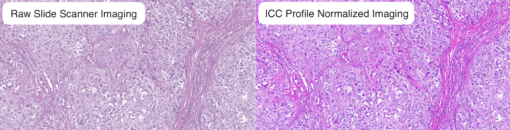

# Digital Pathology DICOM Proxy

The Digital Pathology DICOM Proxy Server wraps the Google DICOM store and adds additional digital pathology specific functionality to the [Google Healthcare API Dicom Store](https://cloud.google.com/healthcare-api).

# Recommended Usage

The Digital Pathology DICOM Proxy is designed specifically to accelerate interactive use cases that demand low latency random access to imaging across a digital pathology image pyramid. The Proxy server performs extensive pre-emptive in memory caching to load, store, and serve digital pathology from in memory caches. 

It is not recommended that batch applications such as machine learning (ML) utilize the proxy. Unlike human readers, ML use cases may rapidly request the majority of frames at a relatively high magnification. Utilizing the proxy to serve these use cases may degrade interactive viewer performance. For ML applications  it is recommended that [EZ-WSI DICOM Web Library](https://github.com/GoogleCloudPlatform/EZ-WSI-DICOMweb) be used. These libraries implement similar frame serving optimizations and designed to be used directly from within Cloud based ML pipelines.

## Overview

The Digital Pathology DICOM Proxy Server adds Digital Pathology Specific functionality to the HealthCare API DICOM Store.

* **Just in time frame caching**: The proxy accelerates DICOMweb [frame](https://cloud.google.com/healthcare-api/docs/reference/rest/v1/projects.locations.datasets.dicomStores.studies.series.instances.frames/retrieveFrames) and [rendered frame](https://cloud.google.com/healthcare-api/docs/reference/rest/v1/projects.locations.datasets.dicomStores.studies.series.instances.frames/retrieveRendered) serving by performing just-in-time frame caching to enable whole slide frame imaging to be served from an in memory cache. The proxy can serve WSI frames at speeds of ~150 ms/frame. To enable this feature attach the proxy to a Cloud Memory Store for Redis. The Proxy will then monitor frame requests, frame requests that cannot be served from the cache are immediately fulfilled and will then trigger the proxy to load the instance's frames into the cache.

* **Enhanced JPGXL Frame Transcoding**: The proxy supports transcoding WSI DICOM images encoded in the JPEGXL transfer syntax into browser friendly image formats (e.g., JPEG, JPEG2000, PNG). [JPEGXL is a state of the art image compression codec, the codec has similar computational cost as JPEG but achieves significantly higher compression ratios and lower signal to noise ratios (SNR) than JPEG](https://jpegxl.info/). The codec has a special feature that enables existing JPEG images to be losslessly transcoded into JPEGXL for a 20-30% reduction in size and then losslessly transcoded back into JPEG for serving.

* **ICC Color Profile Transformation**: The proxy enables the [DICOM standard API]((https://dicom.nema.org/medical/dicom/current/output/chtml/part18/sect_8.3.5.html#sect_8.3.5.1.5)) for server side ICC color profile transformation. This feature reduces slide scanner specific image variability and enhances overall image quality by enabling imaging to be just-in-time transformed at serving time from slide scanner specific color spaces to a common reference color space. Out of the box the proxy supports [transformation to the sRGB, ROMMRGB, and Adobe RGB color spaces](). The proxy can be configured with additional color profiles to enable additional transformations. All imaging transformed by the proxy is embedded with the target profile to enable the imaging to be subsequently transformed by the browser to the monitor's color space for optimal visualization. The image that follows visually un-normalized and normalized imaging.


* **Just-in-time Frame Downsampling**: Generation of just-in-time downsampled representations of DICOM frames from higher magnification imaging via an [extension to the DICOMweb API](https://github.com/GoogleCloudPlatform/medical-imaging/tree/main/pathology/dicom_proxy/docs/dicom_proxy_api.md).

# Authentication
The Proxy utilizes the IAM settings and privileges of the wrapped DICOM store to authenticate user access. Proxy users are required to have [IAM privileges](https://cloud.google.com/healthcare-api/docs/access-control) on the DICOM store. All proxied requests are required to provide a valid Oauth Bearer token with cloud-healthcare oauth scope (`https://www.googleapis.com/auth/cloud-healthcare`). The token is passed to the store as part of the proxied DICOMweb request.

# Data Caching
To accelerate frame serving the Proxy caches DICOM metadata (user bear token level caching), DICOM instance frame imaging, and DICOM instance ICC color profile data. Data is cached in memory. The life of all cached data is controlled by TTL to control the life time of the data in the cache.

# Additional Documentation
* [Deploying Digital Pathology DICOM Proxy IAC.](https://github.com/GoogleCloudPlatform/medical-imaging/tree/main/iac)
* [Configuring the Digital Pathology DICOM Proxy](https://github.com/GoogleCloudPlatform/medical-imaging/tree/main/pathology/dicom_proxy/docs/dicom_proxy_configuration.md)
* [Digital Pathology DICOM Proxy API](https://github.com/GoogleCloudPlatform/medical-imaging/tree/main/pathology/dicom_proxy/docs/dicom_proxy_api.md)


## Requirements

* Recommended OS: Ubuntu 20.04 or higher or Debian 12 or higher
* [Python 3.11+](https://www.python.org/about/)
* [Bazel](https://bazel.build/install)
* [Pip](https://pypi.org/project/pip/) (`sudo apt-get install pip`)
* [Docker](https://docs.docker.com/engine/install/ubuntu/#install-using-the-repository)
    * Ensure you have followed the [post installation steps](https://docs.docker.com/engine/install/linux-postinstall/) before proceeding.
* [gcloud command line](https://cloud.google.com/sdk/docs/install)


## Retrieving the DICOM Proxy Code base 

To get started, clone the repository:

 1. Run the following commands to make an installation directory for
    Cloud Pathology:

  ```shell
    export CLOUD_PATH=$HOME/cloud_pathology
    mkdir $CLOUD_PATH
    cd $CLOUD_PATH
  ```

2. Clone Cloud pathology into the directory you just created:

  ```shell
    git clone https://github.com/GoogleCloudPlatform/medical-imaging.git $CLOUD_PATH
  ```

## Running DICOM Proxy Unit Tests

The DICOM Proxy pipeline Docker executes the DICOM proxy unit tests as the final BUILD step. The unit tests can be executed directly against the code base using Blaze or Python.

1) Run unit tests using Bazel 


```
cd $CLOUD_PATH
cd  ./pathology/dicom_proxy
bazel test …
```

2)  Run unit tests using Python

```
export PYTHONPATH="${PYTHONPATH}:/"
cd $CLOUD_PATH
python3 -m unittest discover -p "*_test.py" -s "$CLOUD_PATH/pathology/dicom_proxy" -t $CLOUD_PATH
```

## Building the DICOM Proxy

To build a new image run:

```
cd $CLOUD_PATH
gcloud builds submit --config=./pathology/dicom_proxy/cloudbuild.yaml \
  --timeout=24h \
  --substitutions=REPO_NAME="<YOUR GCR DESTINATION>",_BASE_CONTAINER="<YOUR BASE CONTAINER GCR>"
```

## Cloud Deployment

To deploy the container you built, follow the deployment instructions in the IaC directory [here](https://github.com/GoogleCloudPlatform/medical-imaging/blob/main/iac/README.md) .

## Local Deployment

To execute the DICOM Proxy container locally or within a virtual machine.

1) Configure docker to gcloud authentication (one time)

```
gcloud auth configure-docker gcr.io
```

2) Pull docker container you built and piushed to cloud.

```
docker pull gcr.io/${MY_REPO_NAME}/dicom-proxy@sha256:${SHA256_HASH}
```

3) Execute the built docker container, configure docker environment variables to initialize the desired configuration.

```
  docker run -d \
  -e CLOUD_OPS_LOG_NAME='dicom-proxy_log' \
  -e CLOUD_OPS_LOG_PROJECT=${MY_PROJECT_NAME} \
  -e ENABLE_DEBUG_FUNCTION_TIMING='FALSE' \
  -e DEFAULT_DICOM_STORE_API_VERSION='v1beta1' \
  -e VALIDATE_IAP='false' \
  -e URL_PATH_PREFIX='' \
  -e TEMP='/temp_dir' \
  --mount type=tmpfs,destination=/temp_dir \
  -p=8080:8080 \
  gcr.io/connectathon2022/dicom-proxy:latest
```