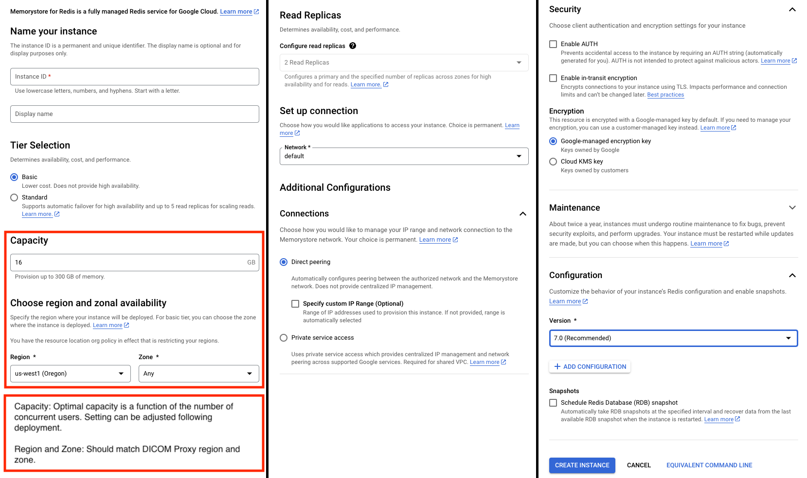
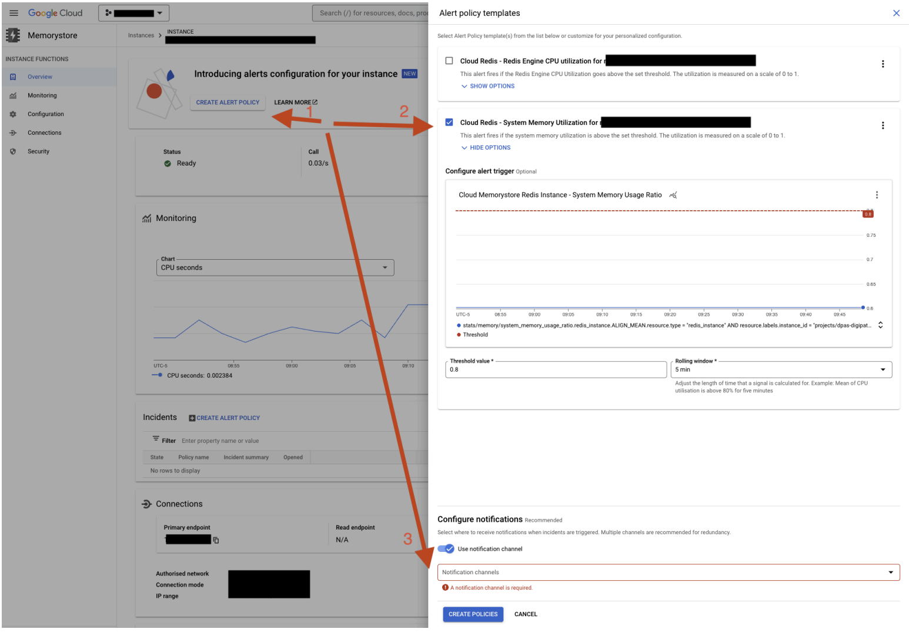

# Digital Pathology DICOM Proxy Server Configuration

The Digital Pathology DICOM Proxy server consists of two primary components: 1) the Proxy server, and 2) a [Redis cache](https://cloud.google.com/memorystore/docs/redis/redis-overview). The Proxy Server is a stateless containerized application that is compatible with [Cloud Run](https://cloud.google.com/run/docs/overview/what-is-cloud-run), [GKE](https://cloud.google.com/kubernetes-engine), and [Compute Engine](https://cloud.google.com/compute) deployments. For optimal performance, Proxy Server(s) and Redis cache(s) should be deployed in the same region as the proxied Google Healthcare API DICOM Store. The setup and configuration settings to deploy the Proxy server are dependent on how the server’s Redis Cache is configured.


## IAM Permissions Required for Digital Pathology DICOM Proxy

* **Logs Writer**:  Required for Cloud Ops
* **Storage Object Viewer**: Required only if [Memory Store For Redis](https://cloud.google.com/memorystore/docs/redis/redis-overview) is used with[ In-transit encryption](https://cloud.google.com/memorystore/docs/redis/manage-in-transit-encryption).

## Proxy Server Load Balancer Settings in GKE and Cloud Run Deployments

* The Digital Pathology DICOM Proxy’s load balancer configuration is required only when the Digital Pathology DICOM Proxy is configured to use an Redis cache that is 1) deployed internally within the Proxy server container and 2) deployed on horizontally scalable platform, e.g., GKE or Cloud Run. For these deployments the load balance should be configured to route users using session affinity ([GKE](https://cloud.google.com/kubernetes-engine/docs/how-to/ingress-configuration#session_affinity), [Cloud Run](https://cloud.google.com/run/docs/configuring/session-affinity)) to promote user usage with the same containerized proxy cache instance. For GKE [cookie](https://cloud.google.com/load-balancing/docs/backend-service#generated_cookie_affinity) based affinity is recommended with relatively long duration TTL cookies (e.g., 60 min).

* Digital Pathology DICOM Proxy Servers deployed on using Memorystore for Redis caches or as single instances *e.g.,* [Compute Engine](https://cloud.google.com/products/compute) deployments do not benefit from specialized load balancer configuration.


## IAP Configuration

The proxy server can be protected by an Identity Aware Proxy (IAP). If served through an IAP proxy then IAP configuration environmental variables must be set.

IAP lets you establish a central authorization layer for applications accessed by HTTPS, so you can use an application-level access control model instead of relying on network-level firewalls. You can define access policies, control access to the Digital Pathology Proxy with an option to implement a zero-trust access model.

1. Enable [IAP for GKE](https://cloud.google.com/iap/docs/enabling-kubernetes-howto).
2. Configure [OAuth consent screen](https://console.cloud.google.com/apis/credentials/consent) and [Credentials](https://console.cloud.google.com/apis/credentials). Consider using an existing OAuth client.
3. [recommended] Get audience token and set container environment variable VALIDATE_IAP to have the server validate [JWT](https://datatracker.ietf.org/doc/html/rfc7519).
4. [recommended] Limit access to application by adding [IAP-secured Web App User](https://cloud.google.com/iap/docs/managing-access#roles) principles.

For more information on cloud deployment, see “[HowTo: Cloud Pathology Preview IaC Playbook](https://github.com/GoogleCloudPlatform/medical-imaging/tree/main/iac)” document.

## Digital Pathology Proxy Server Health Check

Send HTTP GET or POST request to Digital Pathology DICOM Proxy Server Root root ‘/’  

* **Expected responses**:

  * **Expected response if Proxy server is running**:<br>
  'Digital_Pathology_Proxy_Server-Blueprint-Health-Check'<br>
  Content-type= text/html; charset=utf-8<br>
  Status = 200

  * **If the Proxy server is running and configured (default) to use localhost Redis and Redis is not running.**<br>
    'Error connecting to local Redis instance.'<br>
    Content-type= text/html; charset=utf-8<br>
    Status = 400

If Proxy server is running and configured to use an external Redis store (e.g. managed Memorystore for Redis) then Proxy server health checks will not test the health of the Redis instance.  Redis health should be tested directly. Digital Pathology Proxy Server is robust to intermittent Redis availability. 

## Configuring Digital Pathology DICOM Proxy Container

The Digital Pathology DICOM Proxy Server is configured via environmental variables. The following sections describe environmental variables that control the operations of the Digital Pathology DICOM Proxy Server.


### Digital Pathology Proxy Server URL & Connection Flags


#### Environmental Variable: **<span style="color:green">URL_PATH_PREFIX</span>**

* Default Value: **/tile**

* Description:  Base prefix url path used for all connections to digital pathology proxy server.

* Example:

  **<span style="color:green">TILE_SERVER_URL</span>** = [https://www.my_dicom.com](https://www.my_dicom.com)<br>
  **<span style="color:green">URL_PATH_PREFIX</span>** = /tile
  <br><br> Effect: Proxy server requests will be expected to start with: https://www.my_dicom.com/tile/{additional url path components}.


#### Environmental Variable: **<span style="color:green">API_PORT_FLG</span>**

* Default Value: 8080

* Description: Port the Tile server listens for connections on.


#### Environmental Variable: **<span style="color:green">ORIGINS</span>**

* Default Value: **http://localhost:5432**

* Description:  Sets the *[Access-Control-Allow-Origin](https://developer.mozilla.org/en-US/docs/Web/HTTP/Headers/Access-Control-Allow-Origin)* response header which signifies if a response can be shared with the code requesting from a specified origin. It determines an origin, guiding browsers to allow it access to server resources, thus preventing a CORS error. `http://localhost:5432` value is set to make it easier integrate frontend developement.


### Digital Pathology Proxy Server Cache Settings


#### Environmental Variable: **<span style="color:green">FRAME_CACHE_TTL</span>**

* Default Value: 3600

* Description: Maximum time in seconds that frame data is held in Redis cache. Set to value &lt; 0 to disable TTL and keep frames in cache until removed via other mechanisms (*e.g.* LRU). Frame cache is shared across users who have authenticated to access frame data.  Purpose of TTL is to provide an upper bound to the time that data not being accessed can reside in cache. TTL is not a substitute for configuring external Redis store (*e.g.*, Memory store for Redis) LRU Max memory policy.


#### Environmental Variable: **<span style="color:green">USER_LEVEL_METADATA_TTL_SEC</span>**

* Default Value: 600 (valid range 1 min - 1 hr)

* Description: Maximum time in seconds that user level metadata is cached. The TTL ensures that users working entirely from the cached data sources are required to re-authenticate at defined intervals to validate that they retain DICOM store data access privileges.


#### Environmental Variable: **<span style="color:green">BEARER_TOKEN_EMAIL_CACHE_SIZE</span>**

* Default Value: 1000

* Description: Maximum number of resolved bearer token emails cached. Data removed from cache using LRU or based on TTL defined by **<span style="color:green">USER_LEVEL_METADATA_TTL_SEC</span>**. 


#### Environmental Variable: **<span style="color:green">PREEMPTIVE_INSTANCE_CACHE_MAX_INSTANCE_FRAME_NUMBER</span>**

* Default Value: 500000

* Description: This flag sets the upper threshold for the maximum number of frames that an instance can for the server to use to download the whole instance and store.  Instances with frames accounts greater than the threshold will be cached using the block frame caching strategy.

#### Environmental Variable: **<span style="color:green">PREEMPTIVE_CACHE_FRAME_BLOCK_SIZE</span>**

* Default Value: 1000

* Description: This flag sets the maximum number of frames retrieved when the block frame retrieval method is used. By default the frame range requested is centered on the triggering frame number.


#### Environmental Variable: **<span style="color:green">PREEMPTIVE_INSTANCE_CACHE_MIN_INSTANCE_FRAME_NUMBER</span>**

* Default Value: 10

* Description: This sets the lower bounds on the number of frames in an instance which are required to trigger frame caching. For sufficiently small instances it is faster to cache missed frame as they are loaded and not perform additional pre-emptive frame loading.


#### Environmental Variable: **<span style="color:green">PREEMPTIVE_WHOLEINSTANCE_RECACHEING_TTL</span>**

* Default Value: 60

* Description: Minimum time in seconds between whole instance preemptive cache loading operations for the same instance. Use the parameter to reduce whole instance loading induced cache thrashing during periods of high load.


#### Environmental Variable: **<span style="color:green">REDIS_CACHE_HOST_IP</span>**

* Default Value: '127.0.0.1'

* Description: This flag sets the IP address of the Redis store. Empty string disables the cache.  Either 127.0.0.1 or the string “localhost” configure the Proxy to use a Redis store running within the Proxy servers container. All other IP addresses configure the Proxy to use Redis stores running external to the server container.


#### Environmental Variable: **<span style="color:green">REDIS_CACHE_HOST_PORT</span>**

* Default Value: 6379

* Description: Default port number to connect to when connecting to an externally running Redis server. Do not set if running on localhost.


#### Environmental Variable: **<span style="color:green">REDIS_CACHE_HOST_DB</span>**

* Default Value: 0

* Description: Database to connect to on the Redis server.


#### Environmental Variable: **<span style="color:green">REDIS_CACHE_MAXMEMORY</span>**

* Default Value: -1

* Description: Sets maximum memory to use to store frame data when using a Redis store running within the container. If not defined and running using a Redis store running within the Proxy server the redis store max memory will be initialized to ½ of the available free memory at the time of cache initialization. Do not set parameter when running against an external Redis store, e.g., Memorystore for Redis.


#### Environmental Variable: **<span style="color:green">REDIS_AUTH_PASSWORD</span>**

* Default Value: None

* Description: Redis Auth password to use when connecting external Redis store (e.g., Cloud Memorystore for Redis).  Do not set if running against a Redis store running on localhost.


#### Environmental Variable: **<span style="color:green">REDIS_TLS_CERTIFICATE_AUTHORITY_GCS_URI</span>**

* Default Value: ‘’

* Description: Google Cloud Storage URI to blob that contains Redis Certificate of Authority (*.pem) to use to encrypt communications between the Proxy and Redis store. Do not set if running against a Redis store running on localhost. Enabling this will decrease frame serving performance.

### Identity Aware Proxy (IAP) Configurations (Required if Proxy server is an IAP protected endpoint)

#### Environmental Variable: **<span style="color:green">VALIDATE_IAP</span>**

* Default Value: False

* Description: If True then Proxy server will extract IAP provided Email and User ID. IAP is validated via JWT_AUDIENCE.


#### Environmental Variable: **<span style="color:green">JWT_AUDIENCE</span>**

* Default Value: ‘’

* Description: Required if VALIDATE_IAP == True. Proxy server validates IAP by verifying the Proxy server JWT audience by validating the provided IAP_JWT token against the JWT_AUDIENCE provided in this flag.


### Tile Server GUnicorn Configurations


#### Background:
The Proxy is implemented using [Flask](https://flask.palletsprojects.com/en/2.3.x/) running on [GUnicorn](https://docs.gunicorn.org/en/latest/design.html). GUnicron is configured to process requests using threads and processes. Conceptually the total number of workers available to concurrently handle requests simultaneously is the product of the number of processes and threads running on the server. Python, the language the Proxy is implemented in supports concurrent execution of processes and only partially for threads. The environmental variables defined here enable configuration of the number of processes and threads used to handle requests.


#### Environmental Variable: **<span style="color:green">GUNICORN_WORKERS</span>**

* Default Value: **floor(3.4 * number of cpus)**

* Description: Number of processes to use to handle user connections in Proxy server. For more information see [GUnicron docs](https://docs.gunicorn.org/en/latest/design.html). 


#### Environmental Variable: **<span style="color:green">GUNICORN_THREADS</span>**

* Default Value: **5**
* Description: Number of threads to run on each Process to handle user connections. For more information see [GUnicron docs](https://docs.gunicorn.org/en/latest/design.html). 


### Debug Flags (Recommended Leave Default Settings in Production)


#### Environmental Variable: **<span style="color:green">ENABLE_APPLICATION_DEFAULT_CREDENTIALS</span>**

* Default Value: False
* Description: If True and the Proxy servers service account as read permissions on the DICOM store and the calling user does not provide bearer token then tile server will then use its default service account credentials to authenticate for access to DICOM store data.  


#### Environmental Variable: **<span style="color:green">DISABLE_ICC_PROFILE_CORRECTION</span>**

* Default Value: False
* Description: If True disables rendered image icc profile color correction.


#### Environmental Variable: **<span style="color:green">DISABLE_PREEMPTIVE_INSTANCE_FRAME_CACHE</span>**

* Default Value: False

* Description: Disables preemptive frame caching.  Will greatly reduce tile server frame serving performance.


#### Environmental Variable: **<span style="color:green">ENABLE_PREEMPTIVE_WHOLEINSTANCE_CACHEING</span>**

* Default Value: True

* Description: This flag enables the strategy where the Proxy downloads a whole instance and caches all the frames in the instance. If set to False the proxy will only cache instance frames using the block retrieval method.

Environmental Variable: **<span style="color:green">DISABLE_DICOM_METADATA_CACHING</span>**

* Default Value: False

* Description: Disables caching of DICOM metadata within the Proxy.

Environmental Variable: **<span style="color:green">ENABLE_DEBUG_FUNCTION_TIMING</span>**

* Default Value: False
* Description: If true the tile server will add timing metrics to function call logs. Adds significant overhead to function calls. Structured logs not currently visible due to issue with Flask.


### Core implementation (Recommended Leave Default Settings)


#### Environmental Variable: **<span style="color:green">JPEG_ENCODER</span>**

* Default Value: CV2
* Description: Library used to encode raw RGB pixel data to JPEG. The proxy supports using either OpenCV or Pillow. Valid settings = “CV2” or “PIL”.


#### Environmental Variable: **<span style="color:green">MAX_THREAD_POOL_SIZE</span>**

* Default Value: 20
* Description: Maximum size of frame retrieval thread pool.


#### Environmental Variable: **<span style="color:green">MAX_NUMBER_OF_FRAMES_PER_REQUEST</span>**

* Default Value: 100
* Description: Maximum number of frames which can be requested as part of [multipart frame](https://cloud.google.com/healthcare-api/docs/reference/rest/v1/projects.locations.datasets.dicomStores.studies.series.instances.frames/retrieveFrames) request.


#### Environmental Variable: **<span style="color:green">MAX_MINI_BATCH_FRAME_REQUEST_SIZE</span>**

* Default Value: 500
* Description: Internally the Proxy server generates the frames returned to a user in mini-batches. This is done to limit the total working memory required to perform downsampling operations. As an example, to return a frame with 2x downsample typically requires that the proxy server request 4 frames from higher magnification imaging. Default maximum of 500 frames effectively limits the proxy server to performing a maximum of ~22X downsamples.  Theoretically the maximum number of total number of higher magnification downsampled frames which could be retrieved to perform a valid request is the product of  **<span style="color:green">MAX_MINI_BATCH_FRAME_REQUEST_SIZE</span>** and **<span style="color:green">MAX_NUMBER_OF_FRAMES_PER_REQUEST</span>**.


#### Environmental Variable: **<span style="color:green">STREAMING_CHUNKSIZE</span>**

* Default Value: 10240
* Description: Size in bytes of the streaming chunks used to download DICOM instances.


## Redis Configuration


### Background

The redis cache utilized by the proxy can be configured to run either: 1) as a standalone managed Memorystore for Redis store runs external to the Proxy’s container ( Prefered Configuration), or 2) as a sub component within the proxy server container.


#### Memorystore for Redis Configuration

Recommended usage: Multi-user proxy deployments (*Intended use case*)


<table>
  <tr>
   <td style="width:50%"><strong><span style="text-decoration:underline;">Benefits:</span></strong>

</td>
</td>
   <td><strong><span style="text-decoration:underline;">Drawbacks:</span></strong>

</td>
</tr>
<tr>
<td>
<li>Redis Cache can be monitored and managed (e.g. resized) independently from the digital pathology DICOM proxy server deployment.</li>
</td>
<td>
<li>Requires configuration and deployment of Proxy Server and Redis store.</li>
</td>
</tr>
<tr>
<td>
<li>Cache memory is independent from Proxy server working memory.</li>
</td>
<td>
<li>Redis store configured independently from proxy</li>
</td>
</tr>
<tr>
<td>
<li>Digital pathology proxy servers can be run more using economical virtual machines (e.g., less RAM) and can be more aggressively scaled based on usage.</li>
</td>
<td>
<li>Slightly slower proxy server to cache communication.</li>
</td>
</tr>
<tr>
<td>
<li>Digital Pathology proxy server deployment is simplified (Does not require load balancer user affinity)</li>
</td>
<td>
<li>Temporary storage of DICOM imaging in Redis memory store that could be connected to by other applications.</li>
</td>
</tr>
<tr>
<td>
<li>Proxy server scaling does not affect cache state or availability.</li>
</td>
<td>
</td>
</tr>
</table>

#### Running Redis cache from within Digital Pathology DICOM Proxy Container.

Recommended usage: Non-Scaling VM based deployments.

<table>
  <tr>
   <td style="width:50%"><strong><span style="text-decoration:underline;">Benefits</span>:</strong>
  </td>
  <td>
  <td><strong><span style="text-decoration:underline;">Drawbacks:</span></strong>
  </td>
  </tr>
  <td>
  <li>Single container deployment and setup.</li>
  </td>
  <td>
  <li>Requires load balancer user affinity mapping or single non-scaling deployment.</li>
  </td>
  </tr>
  <tr><td>
  <li>Communication between proxy server and cache occurs in memory from within the same machine.</li>
  </td>
  <td>
  <li>Changes to redis cache require resetting DICOM proxy.</li>
  </td>
  </tr>
  <tr><td>
  <li>Redis memory store is not accessible from outside web services.</li>
  </td>
  <td>
  <li>Due to in server caching proxy server requires substantial RAM.</li>
  </td>
  </tr>
  <tr>
  <td>
  <li>Conceptually can scale to higher total cache sizes.
  </li>
  </td>
  <td>
  </td>
  </tr>
  </table>

### Configuring Memorystore for Redis (Recommend)

In this configuration Memorystore for Redis instance is configured as an independent component from the Proxy server. The Redis memory store should reside within the same region  as the Proxy and DICOM store.  For multi-region deployments the proxy server and cache should be deployed in each of the underlying regions which serve the multi-region deployment.


#### [Setting up Redis Memory Store](https://cloud.google.com/memorystore/docs/redis/redis-overview)

Using a redis cache external to the proxy server enables the redis instance to be configured and managed independently from the Proxy server. The proxy server is robust to intermittent cache availability. Inability to access the cache will degrade Proxy performance.

Recommended Settings:

1. Tier: BASIC
2. Capacity: (1 - 2 GB per expected concurrent user
3. Location/Region: Same location/region as Proxy and DICOM store deployments.
4. Setup connection: default
5. Connections: Direct peering; Specify custom IP range:
6. Security (Optional):
  * [Auth](https://cloud.google.com/memorystore/docs/redis/about-redis-auth)<br>If configured proxy server required to present authentication password to Redis cache. Note: If in-transit encryption not set, auth, sent as free text and does not provide security, but can be used to validate the proxy server is being connected to the expected Redis Cache.
  * [In-transit encryption](https://cloud.google.com/memorystore/docs/redis/about-in-transit-encryption)<br>Encrypts data between Proxy server and Redis Store.
7. Maintenance (No recommendation)
  * Defaults: Day (Any) ; Time (Any)
8. Configuration:
  * Version: 7.0
9. Snapshots: unchecked.

Example: 16 GB instance


**Console Command:**

```
gcloud redis instances create --project=example_project  example_instance --tier=basic --size=16 --region=us-central1 --redis-version=redis_7_0 --network=projects/example_project/global/networks/default --connect-mode=DIRECT_PEERING --enable-auth
```


#### Connecting the Digital Pathology DICOM Proxy to Memorystore for Redis

Configure the following environmental variables on the Digital Pathology DICOM Proxy:

* **<span style="color:green">REDIS_CACHE_HOST_IP</span>**: IP address of the Memorystore for Redis instance.
* **<span style="color:green">REDIS_CACHE_HOST_PORT</span>**:  Memorystore for Redis port.


### Preventing out of memory conditions (OOM) on Cloud Memory Store for Redis


* **Configuring Memorystore for Redis Max Memory Policy (REQUIRED)**<p>By default Memorystore for Redis will not automatically remove items from the cache when the cache is full. This will result in out of memory conditions. The store should be configured to automatically remove the least recently used keys. *This is accomplished by setting the [maxmemory-policy](https://cloud.google.com/memorystore/docs/redis/supported-redis-configurations#maxmemory_policies) for the store to allkeys-lru*.

**Console Command:**

```
gcloud redis instances update <span style="color:green">{REDIS_INSTANCE_NAME}</span> --update-redis-config maxmemory-policy=allkeys-lru --region <span style="color:green">{REDIS_INSTANCE_REGION}</span>
```

* **[Configuring Memorystore for Redis to Auto-defragment (Highly recommended)](https://cloud.google.com/memorystore/docs/redis/memory-management-best-practices)**<p>By default Memorystore for Redis will not automatically defragment working memory. This can lead to out of memory conditions. To enable auto-defragmentation execute the following command once in the cloud console.

**Console Command:**

```
gcloud redis instances update <span style="color:green">{REDIS_INSTANCE_NAME}</span> --update-redis-config activedefrag=yes --region <span style="color:green">{REDIS_INSTANCE_REGION}</span>
```

* **[Configuring Memorystore for Redis to max memory at 80 - 90% of Redis store size (Highly recommended)](https://cloud.google.com/memorystore/docs/redis/memory-management-best-practices)**<p>By default Memorystore for Redis configured with a **max memory policy of allkeys-lru** will purge keys when total data exceeds the store size. Redis key eviction occurs in a background process and as a result [rapid system usage can result in OOM conditions](https://cloud.google.com/memorystore/docs/redis/memory-management-best-practices). To reduce these risks the store maxmemory-gb should be set to 80% - 90% of the allocated stores size.

**Console Command:**

```
gcloud redis instances update <span style="color:green">{REDIS_INSTANCE_NAME}</span> --update-redis-config maxmemory-gb=<span style="color:green">{SIZE}</span> --region <span style="color:green">{REDIS_INSTANCE_REGION}</span>
```

* **[Configure Cloud Memory Store for Redis to Issue Notifications if System Memory Usage Exceeds 80% ](https://cloud.google.com/memorystore/docs/redis/memory-management-best-practices)(Optional)**<p>Cloud Memory Sore for Redis can be configured to issue alerts if it experiences memory pressure which could result in OOM conditions. Notifications can be configured via the cloud console. To configure select the desired Redis instance then:
    1) Click, “Create Alert”
    2) Select System Memory Utilization and set threshold value to 0.8 (default value)
    3) Select/configure appropriate notifications and click create policies. To decrease system memory utilization do one or more of the following:
       * Increase size of Redis instance.
       * Lower maxmemory-gb setting; for more information see the[ Memory management best practices](https://cloud.google.com/memorystore/docs/redis/memory-management-best-practices) doc.



### Authentication and Encryption Configurations for Cloud Memory Store for Redis


#### [Configuring Authentication (Optional)](https://cloud.google.com/memorystore/docs/redis/manage-redis-auth)

1. When creating the Redis Memory store select enable Auth otherwise select a running store and select Configuration -> Edit -> Security -> Select or Deselect enable Auth.
2. If Auth is being enabled. The auto generated auth id will be displayed within the Redis Memory stores cloud console. Copy the value and initialize the Digital Pathology DICOM Proxy <span style="color:green">REDIS_AUTH_PASSWORD</span> to the auth value.


#### [Configuring In-transit encryption (Optional)](https://cloud.google.com/memorystore/docs/redis/about-in-transit-encryption)

The need for In-transit encryption should be validated. <span style="text-decoration:underline;">Enabling encryption will reduce tile-server frame serving performance.</span>


1. Enable In-transit encryption during creation of the Memory Store for Redis.
2. Place  [Certificate Authority](https://cloud.google.com/memorystore/docs/redis/in-transit-encryption#certificate_authority) (CA) within a [GCS bucket.](https://cloud.google.com/memorystore/docs/redis/manage-in-transit-encryption#downloading_the_certificate_authority) 
3. Give the Digital Pathology DICOM Proxy service account **Storage Object Viewer Permission** on the Bucket and/or blob.
4. Give Digital Pathology DICOM Proxy service service account IAM **Storage Object Viewer permission.**
5. Configure Digital DICOM proxy to read Redis Certificate of Authority from the bucket. Set <span style="color:green">REDIS_TLS_CERTIFICATE_AUTHORITY_GCS_URI</span></strong> to gcs uri that points to the file.

    Example: REDIS_TLS_CERTIFICATE_AUTHORITY_GCS_URI=’gs://foo/bar.pem


### Configuring the Redis Cache to Run Inside Digital Pathology DICOM Proxy


#### Configure the following environmental variables on the proxy:


1. **<span style="color:green">REDIS_CACHE_HOST_IP</span>** = ‘localhost’ or ‘127.0.0.1’
2. **<span style="color:green">REDIS_CACHE_HOST_Port</span>**: 6379 or leave uninitialized.
3. **<span style="color:green">REDIS_CACHE_MAXMEMORY</span>** (Optional): Maximum size in gigabytes bytes of Redis cache.  If unset defaults to about  half of free working memory of the Proxy server.


#### Load Balancer Configuration (Required if running in Cloud Run or GKE)

If the digital pathology DICOM proxy is being deployed within a GKE cluster user then the cluster's load balancer needs to be configured to preferentially map users' requests to the same pod. This is required because the cache is local to the pod and for the cache to function effectively user requests should when possible be handled by the same pod.  Cookie based user affinity mapping with very long TTL is recommended for GKE. Failure to properly configure the load balancer will degrade performance but not block deployment.

If the digital pathology DICOM proxy is being deployed within a single instance (e.g., Compute Engine) then this configuration is not necessary as all requests will be handled by the same containerized instance.
