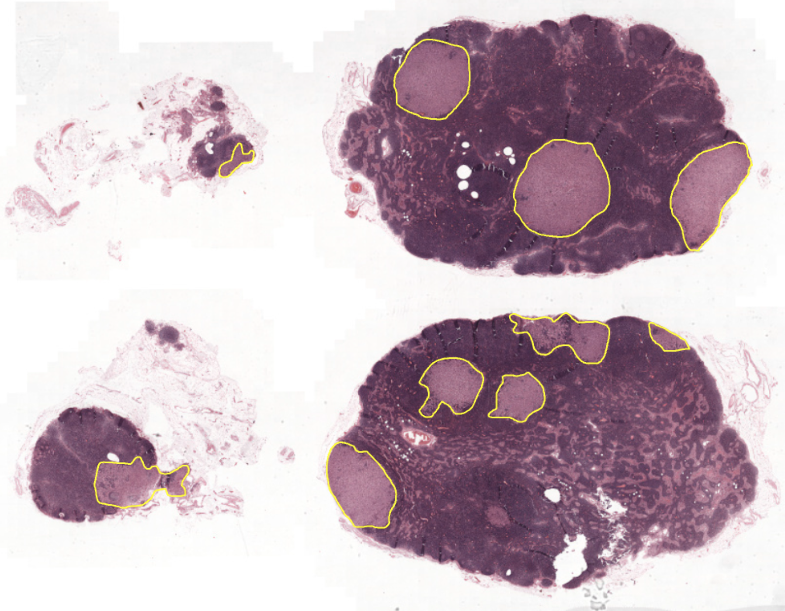

# Zero Footprint DICOMWeb Pathology Viewer

<center></img></center>

## Overview

The Pathology Viewer is a single-page application designed to interact with, visualize, and annotate DICOM images, adhering to DICOM-web standards. It seamlessly integrates with any server supporting DICOMWeb, enabling its deployment and utilization across various devices equipped with web browsers.

## Features of the Pathology Viewer

1. **Search Functionality:** Users can effectively search for cases, patient IDs within the DICOM store, and FHIR diagnostic reports using keywords. This feature empowers users to access cases, slides, patient information, and diagnostic reports based on their queries.

2. **Tissue Viewer:** The Viewer presents a case (series) of Whole Slide Images (WSI) and flat images. It leverages the Digital Pathology DICOM Proxy if configured.

3. **Basic Annotation Tools:** Users can view annotations created by others and participate in or manage their own annotation processes, utilizing the [Microscopy Bulk Simple Annotations](https://dicom.nema.org/medical/Dicom/2024c/output/chtml/part03/sect_C.37.html#sect_C.37.1.2) standard (supplemental 222). This feature aims to foster collaboration and enhance labeling for machine learning purposes. Additional annotation resources:

<table border="0"><tr><td width="200px">
</img></td><td>
   <li>Overview of DICOM <a href="https://dicom.nema.org/medical/dicom/Supps/Slides/sup222_WSIAnnotations_overview.pdf">Bulk Microscopy Simple Annotations</a>.</li>
   <li><a href="https://github.com/GoogleCloudPlatform/medical-imaging/tree/main/pathology/docs/annotations/2024_connectathon_summary.pdf">2024 ECDP presentation</a> for the DICOM digital pathology working group that reports findings of the 2024 DICOM annotation connectathon.</li>
   <li>The WSI DICOM imaging with associated bulk microscopy simple annotation tested at the 2024 DICOM connectathon are shared at: <a href="ftp://medical.nema.org/MEDICAL/Dicom/DataSets/WG26/WG26Connectathon2024/">ftp://medical.nema.org/MEDICAL/Dicom/DataSets/WG26/WG26Connectathon2024/</a>. If your web browser does not support FTP then it is recommended to use <a href="https://filezilla-project.org/">Filezilla</a> or other third party FTP clients to connect to the NEMA FTP site. Authentication is not required.
</td></tr></table>

## Search bar

The search bar facilitates data access within the DICOM store. It enables searching for:

1. Accession number of DICOM studies (typically associated with case IDs), DICOM tag (0008,0050).
2. Patient ID of DICOM studies, DICOM tag (0010,0020).
3. Keyword search for FHIR DiagnosisReports text (case notes). This results in all matching reports, and if their ID matches an ID in the DICOM Store, the corresponding slides are displayed. This feature is available only if configured and populated.

Search results are organized by cases when multiple cases are involved, and associated slides in the image DICOM store can be previewed. In the case of a FHIR search, the case notes can be viewed.

## Tissue viewer

The tissue viewer page empowers users to delve into WSI imagery streamed from a DICOM store.

* The left widget displays the slide label when available, along with all associated metadata. When annotations are available, it also contains the annotation tools.
* The bottom widget lets the user browse through all slides of the same study (case). Side-by-side views are also possible.

# How to build & run

## To set up project and dependencies

```shell
git clone https://github.com/GoogleCloudPlatform/medical-imaging
cd medical-imaging/pathology/viewer`
npm install
```

## Development server

To execute the application locally, pointing to a development environment: 

```shell
npm run start
```

Navigate to `http://localhost:5432/`. The application will automatically reload if you change any of the source files.

## Viewer Configuration

The open source viewer's configuration is facilitated through environment files:

* `src/environments/environment.development.ts` - For development using `npm start`.
* `src/environments/environment.ts` - For production builds (e.g., `npm run build`).

In the section [Viewer Configuration Parameters](#viewer-configuration-parameters) below, you will find detailed descriptions of the configuration parameters.

For demonstration only, this was preconfigured to point to IDC dicomweb server. You can
find case ID and patient ID to display in the
[IDC data explorer](https://portal.imaging.datacommons.cancer.gov/explore/filters/?Modality_op=OR&Modality=SM).
Examples:

- [TCGA-A6-2671](http://localhost:5432/search?q=TCGA-A6-2671)
- [TCGA-EJ-7781](http://localhost:5432/search?q=TCGA-EJ-7781)

> _NOTE_: The IDC is intended for limited user viewing only and is not meant for
> image downloads. Read more [here](https://learn.canceridc.dev/portal/proxy-policy).

## Build for production

Run `npm run build` to build the project. The build artifacts will be stored in the `dist/` directory. Those can be served in various ways. See the list of options in [Website hosting in Google Cloud](https://cloud.google.com/architecture/web-serving-overview). When choosing, take into account your security, authentication, privacy requirements, and whether a custom domain name is needed. In principle, this viewer can technically be statically hosted.

Some of those methods require a docker container. We created the Dockerfile and nginx.conf to serve the static files from a docker container as an example.

To build the docker container and run it locally:

```shell
docker build -t path-viewer .
docker run -p 5432:5432 path-viewer
# http://localhost:5432` in a local browser.
```

# Viewer Configuration Parameters & Data Requirements

## Configuring the tissue viewer

* **IMAGE_DICOM_STORE_BASE_URL** - (String ***REQUIRED***) Specifies the base URL for the DICOM store where images are sourced. For Google Cloud Healthcare DICOM stores, provide the full store URL (including project ID, location, dataset ID, and DICOM store ID) in the format:  `https://healthcare.googleapis.com/v1/projects/PROJECT_ID/locations/LOCATION/datasets/DATASET_ID/dicomStores/DICOM_STORE_ID/dicomWeb`. For other DICOMWeb servers, supply the equivalent base URL for the target DICOM store, ensuring the inclusion of dicomWeb in the path if mandated by the server. If you're utilizing the [Pathology Dicom Proxy](https://github.com/GoogleCloudPlatform/medical-imaging/tree/main/pathology#dicom-proxy), utilize the proxy as the server.
* **ENABLE_SERVER_INTERPOLATION** - [boolean, default "false"]. Enable this parameter if the [Pathology Dicom Proxy](https://github.com/GoogleCloudPlatform/medical-imaging/tree/main/pathology#dicom-proxy) is used with this viewer and is specified as the server in IMAGE_DICOM_STORE_BASE_URL. The proxy enables proprietary features for server-side ICC color correction, server-side layer interpolation, and write access to DICOM annotations.

## Authentication

This application employs OAuth2.0 to authenticate the user and leverage their credentials for accessing the backends (DicomStore, FHIR or Pathology Dicom Proxy). If your backends lack authentication requirements, you can skip this section. 

* **OAUTH_CLIENT_ID**: (String, default "") The [OAuth2.0 client ID](https://support.google.com/cloud/answer/6158849) to be used with your application.
* **OAUTH_SCOPES**: (String, default "https://www.googleapis.com/auth/cloud-healthcare email") The OAuth scopes to be used with your application. See [OAuth Scopes](#oauth-scopes) below for more details.

### OAuth Scopes
The OAuth scopes required by this viewer are:
* `https://www.googleapis.com/auth/cloud-healthcare` - OAuth scope provides access to the Google Cloud Healthcare API. This API enables applications to interact with healthcare data stored in a Dicom Store, and FHIR Store.
* `email` - Used to identify the annotations created by the user. See option to store hash email rather than store the email address along with the DICOM annotation.

> _TIP_: Under the Authorized JavaScript origins section, add: `http://localhost:5432` for this to work with the [development server](#development-server). 

## Configuring Angular Routing

This section outlines the configuration process for the URL structure of your Angular application when deploying the DICOM viewer.

*   **APP_BASE_SERVER_PATH**: (String, default: "") Specifies the base URL path for the viewer.  This is useful when deploying the viewer to a subdirectory on a server.
    *   Format:  `https://<domain>/<rootpath>/`.  Do not include the function name in this path.  For example: `https://example.com/viewer/`
*   **USE_HASH_LOCATION_STRATEGY**: (Boolean, default: "false") Determines whether to use hash-based routing.
    *   `true`:  The URL will include a hash (`#`) followed by the route. This is sometimes necessary for compatibility with certain web servers or deployment scenarios.  Example: `example.com/#/view-slide`
    *   `false`: (Default) Uses standard path-based routing. Example: `example.com/view-slide`

## Configuration of Annotations

To activate annotation features in the Pathology Viewer, users require read access to the DICOM store configured for annotations. Write access can be granted, enabling users to create and modify annotations directly. Alternatively, more granular control over write operations can be achieved by leveraging features offered by the DICOM proxy. If a DICOM store isn't specifically configured for annotations using ANNOTATIONS_DICOM_STORE_BASE_URL, annotations can still be created, but they won't be persisted and will only reside in memory for the duration of the current session.

* **ANNOTATIONS_DICOM_STORE_BASE_URL**: (String, default: "") Specifies the base URL for the DICOM store where annotations are stored and retrieved, following the same format outlined under IMAGE_DICOM_STORE_BASE_URL.
* **ENABLE_ANNOTATIONS** - (Boolean, default: "false") Enables the annotation features in the UI. Requires ANNOTATIONS_DICOM_STORE_BASE_URL to be set and proper permissions configured; When set to "false", all annotation UI components will be disabled.
* **ENABLE_ANNOTATION_WRITING** - (Boolean, default: "false") Determines whether users can write DICOM annotations to the store specified in **ANNOTATIONS_DICOM_STORE_BASE_URL**. When set to false, the viewer will disable UI components related to writing annotations and will be in view-only mode.
* **ANNOTATION_HASH_STORED_USER_EMAIL** - (Boolean, default: "false") When writing annotations to the server, the creator of the annotations is identified using their email address. In scenarios where the email should not be exposed to other users, this parameter can be set to true, which will cause the emails to be stored as hashes. 
* **DICOM_GUID_PREFIX** - (String, default: "1.3.6.1.4.1.11129.5.7.0.1") Identifier used in the DICOM standard to uniquely identify proprietary data elements or extensions specific to Google, Inc. within medical imaging applications. It is stored as a DICOM tag in the stored annotations.

## User annotations DICOM store using Microscopy Bulk Simple Annotations

The proxy server can be configured to write and delete annotations on behalf of a user to a specified annotation DICOM store. This approach offers minimal protection for manually created annotations. This experimental feature utilizes a service account for POST and DELETE calls exclusively for MICROSCOPY_BULK_SIMPLE_ANNOTATIONS_IOD (1.2.840.10008.5.1.4.1.1.91.1).

* For a POST call, the service populates the user’s email address to DICOM tag:
    * OperatorIdentificationSequence (0008,1072)
        * PersonIdentificationCodeSequence (0040,1101)
            * LongCodeValue (0008,0119)

* DELETE calls will only work if the user’s email address matches the stored email address above.
* There is no impact on reading. The user's credentials are used to read, and the proxy passes those requests through unmodified.
* To enable, see DICOM Proxy configuration:
    * Proxy environment variable ENABLE_ANNOTATIONS_ENDPOINT = True (Default False) to enable this feature.
    * Proxy environment variable DICOM_ANNOTATIONS_STORE_ALLOW_LIST = comma-separated list of DICOM stores to apply this feature. Use format `projects/.../locations/.../dicomWeb`
    * A user must have read access to the annotation DICOM store using their own credentials.
    * The DICOM proxy service account must have write permission

## Pathology FHIR Search Via Pathology Viewer
The viewer facilitates the retrieval of pathology cases based on data stored in a FHIR Store, leveraging existing FHIR standard API search capabilities: [free-text](https://cloud.google.com/healthcare-api/docs/how-tos/fhir-advanced-search#text_search) search of [FHIR Diagnostic Reports](https://build.fhir.org/diagnosticreport.html).

### Search variables

* **FHIR_STORE_BASE_URL** - (String, default "") Specifies the FHIR store URL to be used for searching. If not provided, the FHIR feature is disabled in the UI. URL formatted as: `https://healthcare.googleapis.com/v1/projects/PROJECT_ID/locations/LOCATION/datasets/DATASET_ID/fhirStores/FHIR_STORE_ID`.

* **SEARCH_UPPERCASE_ONLY** - (String, default "false") Determines whether all text in the search bar is forced to uppercase. Useful when patient IDs and Accession numbers are uppercase, since DICOMWeb search is case-sensitive. Default is false.

### Supported operators
Supported natively by the FHIR API.
* `|` is the OR operator 
Example “abc | def | ghi xyz” will match a resource that contains “xyz” and one or more of “abc def ghi”.
* `-` is the NOT operator
Example “abc -def” will match a resource that contains “abc” but does not contain  “def”.
* `⎵` (Space) is the AND operator
Example “abc  def ghi xyz” will match a resource that contains all the words: “abc” and “def” and “ghi” and “xyz”.

### FHIR Data Requirements
Population of the **searched field**. The text field being searched is DiagnosticReport.**text** ([ref](https://build.fhir.org/domainresource-definitions.html#DomainResource.text)) which is inherited from DomainResource.text
Population of the **case id** (ascension number) in the DiagnosticReport.**identifier** ([ref](https://build.fhir.org/diagnosticreport-definitions.html#DiagnosticReport.identifier)).

Cases represented as DICOM studies should have the same case id (ascension number) as provided in FHIR.

### FHIR DiagnosisReport Example

Minimal DiagnosisReport as JSON:
```
{
    identifier: [{value: 'accession-id-here'}],
    meta: {
        lastUpdated: '2022-11-08T22:58:26.874273+00:00',
    },
    resourceType: 'DiagnosticReport',
    text: {
        div: 'searched text here',
    }
}
```

### Handling of Special Cases

#### Missing DiagnosticReport.identifier
The search UI will present the results, but will indicate the case id is unknown and display no images associated with it.
#### No matching case id in DICOM store
The search UI will present the results, but will display no images associated with it.

### Disable Search
To disable search in the UI, do not set FHIR_STORE_BASE_URL or set it as an empty string.

### Using a Proxy
The https://healthcare.googleapis.com/v1/ can be replaced by a proxy, e.g. apigee proxy.
